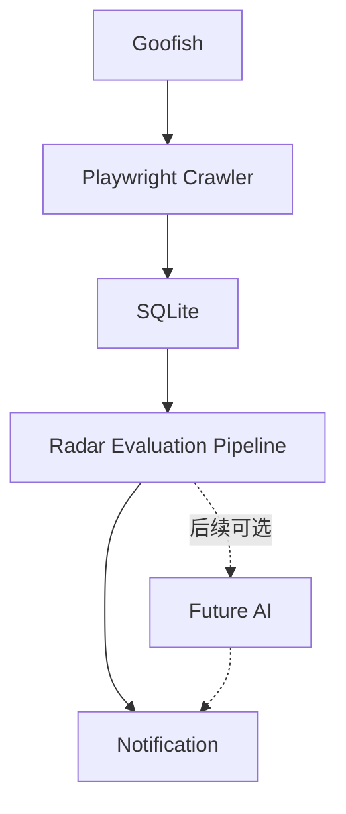

# Goofish Treasure Radar / 电子垃圾猎手

An **AI-assisted second-hand electronics treasure radar**. 当前 MVP 使用规则引擎，零 LLM 调用，寻找值得立刻点开看的复古、稀有和可折腾电子设备。它不决定你要不要购买，也不把便宜直接当作宝藏。

基于 [Usagi-org/ai-goofish-monitor](https://github.com/Usagi-org/ai-goofish-monitor) 的 MIT 代码导入，保留 Playwright 采集、登录态、SQLite、FastAPI + Vue 管理、APScheduler 和 Bark/Webhook 通知。上游版本、源码审查与同步步骤见 [UPSTREAM.md](UPSTREAM.md) 和 [源码审查报告](docs/upstream-research.md)。原版权和 [LICENSE](LICENSE) 保留。

## 架构



实时接入在现有分析分发器：商品详情 → 输入校验/去重 → Money Extractor → Price Integrity → Model Extractor → Interest Rules → EvaluationResult → SQLite → 兴趣候选通知。上图 SQLite → Radar 也支持已有数据 backfill。爬虫只额外保存正文；不在采集代码内实现推荐规则。

## 快速运行（无需账号或 API key）

Python 3.11+。独立 Radar 仅依赖标准库：

```bash
python -m src.radar --input examples/items.jsonl --db data/radar-demo.sqlite3
```

每行输出 JSON，保存 SQLite。重复运行输出 `duplicate: true`，不会增加相同观察。也可 `--input -` 接收 stdin。输入失败会打印行号并返回非零；CLI 和 backfill 不发网络通知。

```python
from src.radar import Radar, EvaluationStore

radar = Radar(EvaluationStore("data/app.sqlite3"))
result = await radar.evaluate({
    "item_id": "123",
    "title": "SHARP LJ64HB34 TFEL 拆机屏",
    "listed_price": 50,
    "description": "2200出，诚心要最低2000，库存不会测试",
})
print(result.to_dict())
```

支持上游 `{"商品信息": {"商品ID": ..., "商品标题": ..., "当前售价": ..., "商品描述": ...}}`。缺失 item_id 或 title 会拒绝；不使用空 ID 合并不同商品。

## Docker Web 管理与定时监控

安装 Docker 和 Compose v2.24+：

```bash
cp .env.example .env
# 编辑 .env，填写自己的 WEB_PASSWORD；保持 RADAR_ENABLED=true
mkdir -p data state logs images jsonl price_history prompts
docker compose up -d --build
```

访问 http://127.0.0.1:8000，用 `.env` 中用户名和密码进入。镜像从本仓库构建，包含新增 Radar，不能替换成上游现成镜像。持久化目录保留登录态与数据库，默认只绑定本机。

1. 使用官方闲鱼页面自行登录。可用保留的 `chrome-extension/` 导出登录态，再在 Web 的账号管理页导入；不要把导出文件上传 GitHub。
2. 新建任务，如 `CRT 监视器`、`VFD 客显`、`TFEL`、`示波器`、`拆机模块`。选择关键词模式、关闭图片分析，绑定自己的账号。Radar 启用时会接管分析，不调用上游 LLM、图片下载或额外卖家资料采集。
3. 每个任务最多采集一页；建议少量关键词错峰、每两小时一轮，例如 `17 */2 * * *`。不要并行开启大量任务或高频手动重跑。
4. 在通知设置填自己的 Bark 或 Webhook 地址。首次达到兴趣阈值的商品才通知；同一内容跨任务重复不重复通知。低价不会单独触发，也不会单独过滤。
5. 从“所有结果”查看候选和理由。上游界面尚无 Radar 专属过滤器；`radar_evaluation` 保存在结果 JSON 内，完整结构在 SQLite 中。

配置例子在 `config.json.example`，默认任务关闭。JSON CLI 任务可 `python spider_v2.py --config config.json.example`；实际监控前自行启用并设置账号路径。

运行已有数据库评估（不改变原始结果表）：

```bash
python -m src.radar --backfill --db data/app.sqlite3
# Docker 中：
docker compose exec app python -m src.radar --backfill --db /app/data/app.sqlite3
```

本机开发：安装 `requirements.txt`，执行 `python -m playwright install chromium`，前端 `cd web-ui && npm ci && npm run build`，然后 `python -m src.app`。本机入口监听所有网卡时请使用防火墙或改用 `python -m uvicorn src.app:app --host 127.0.0.1 --port 8000`。

**管理界面限制：上游登录页不是完整的服务器端 API 授权边界。当前仅适合可信本机使用；不能直接公开映射到互联网。远程使用前需认证反向代理（包含 WebSocket）和 HTTPS。**

## 价格可信度

`price_confidence` 是 0–100 的规则分数，回答“标价是否代表用接近这个价格买到标题中的主要商品”，不是经统计校准的概率，也不保证真伪、品相或交易安全。

| 类型 | 含义 |
| --- | --- |
| REAL_PRICE | 未发现正文冲突或特殊交易信号 |
| NEGOTIABLE_REAL_PRICE | 正常可刀/议价，仍是实价 |
| PLACEHOLDER_PRICE | 明确占位、禁止直接拍，或正文价格明显冲突 |
| DEPOSIT_PRICE | 定金，明确总价可填 effective price |
| PARTIAL_PRICE | 配件、单件、尾款或最低配置价 |
| RENTAL_PRICE | 租赁，购买有效价格为空 |
| WANTED_PRICE | 求购/回收，不是出售价格 |
| UNCERTAIN | 标价缺失，或常见占位数值但缺乏明确假价证据 |

例如 `50 / 2200出，最低2000` → 正文 `[2200,2000]`，有效区间 2000–2200，标记 `PRICE_MISMATCH`。原价、运费、押金等参考金额不用于与标价比较。`220V / 50Hz / 100MHz / 2020年 / 640x480` 不提取为价格。常见数字价格单独出现不直接定性为假价；明确“1元出”保留低价机会。

## 数据与模块

`src/radar/`：`schemas.py`、`rule_filter.py`、`money_extractor.py`、`price_integrity.py`、`model_extractor.py`、`interest_rules.py`、`pipeline.py`、`storage.py`、`cli.py`。

新增表均为 additive migration，不修改或删除原表：

- `radar_schema_versions`：独立 migration 标记。
- `radar_evaluations`：每个商品最新评估，包含价格分类/置信度、有效区间、兴趣分、型号/风险/兴趣 flags、原因和 UTC 时间。
- `radar_observations`：按 ID + 规范化内容哈希 + 引擎版本去重的历史评估；规则阈值变化会重新评估。
- `model_price_history`：只保存可信完整商品的挂牌价格，含 model/item_id/price/condition/observed_at；不把假价、定金当行情。condition 目前为空，型号仍是候选，不是确认识别。

SQLite WAL、事务和唯一键保证并发重复输入只产生一个新观察。页面详情发生变化可重新评估，但**上游 crawler 会跳过已处理链接**，所以当前不会主动重访旧商品；需导入新的观察，后续增加低频重访。历史目前是挂牌样本，不是成交记录。

## 验证

```bash
python -m pip install -r requirements.txt
python -m pytest -m "not live"
cd web-ui && npm ci && npm run build
```

CI 在 Ubuntu / Windows 上运行离线测试，在 Ubuntu 上构建前端。真实闲鱼测试需要自有账号、有效登录态和人工处理验证，不在 CI 执行。完整验证与当前限制见 [验证记录](docs/validation.md)。

## 后续接口

`AIEvaluator` Protocol 已预留，MVP 不调用。计划：rules → cheap text model → multimodal model → Treasure Score，显式开关、预算和缓存控制。未来指标：`interest_score`、`price_confidence`、`deal_score`、`treasure_score`；分解 rarity / retro_tech / hackability / visual_interest / documentation / price_attraction / seller_signal，绝不只有便宜程度。

历史价格后续做型号归一、样本品相和可信度筛选、`market_median` / `price_ratio` / `price_anomaly`；低价 + 高价格可信度 + 高兴趣 → Treasure Alert。MVP 保留这种商品。

下一步优先：人工标注实际商品校准规则；通知 outbox/重试与 Radar 专属视图；选择性多模态铭牌识别及可信价格统计。

## 使用边界

尊重闲鱼服务条款，只用于个人商品发现和研究。不高频请求，不绕过验证码或平台安全机制，不实现验证码破解，不自动下单，不自动向卖家发送骚扰式消息。验证码或登录失效时停止，人工在官方页面处理。已移除上游 webdriver 隐藏和浏览器安全覆盖；Radar 模式不切换账号/代理重试挑战。

`.env`、Cookie、Token、浏览器 state、SQLite 和运行结果不进入版本库。通知 URL 也可能含密钥，只在本机保存。服务首次启动不代表已开始监控，仍需你本人导入有效登录态并启用任务。


## Android 自用 App（0.1.0-alpha）

客户端名称 **Treasure Radar**，包名 `com.langxie.treasureradar`。使用 Capacitor 8 包装现有 Vue UI；Playwright、SQLite、爬虫和定时任务始终运行在 PC / NAS / server。

### 安装 APK

打开 [v0.1.0-alpha Release](https://github.com/langxie29-cpu/goofish-treasure-radar/releases/tag/v0.1.0-alpha)，下载 `treasure-radar-v0.1.0-alpha-debug.apk`。备用下载：GitHub Actions → Android APK → 成功的 run → `treasure-radar-debug.apk` artifact，解压 ZIP 后安装 APK。Release 附带 SHA256SUMS。

在 Android 上点开 APK，按系统提示允许当前文件管理器/浏览器“安装未知应用”，完成安装；安装后可关闭此权限。这是个人 debug 版，最低 Android 7 / API 24；不是应用商店版本。不同 CI runner 自动生成的 debug 签名可能不同；出现签名不一致时需卸载旧版再安装，后端数据不会丢失，但手机端地址设置需重填。

### 电脑 / NAS 后端

1. 复制 `.env.example` 为 `.env`，设置 `WEB_PASSWORD`。规则模式无需 AI API Key。
2. 查看电脑局域网 IPv4，例如 `192.168.1.20`。在 `.env` 中加入 `RADAR_BIND_ADDRESS=192.168.1.20`，以便手机访问；默认仅绑定 `127.0.0.1`。
3. 执行 `docker compose up --build -d`（镜像已经构建时 `docker compose up -d`）。只在可信家庭局域网使用，防火墙仅放行该可信网段到 8000。不要在路由器上做公网端口转发。
4. 手机与电脑连同一个网络，先用手机浏览器检查 `http://192.168.1.20:8000/health`。
5. App 首次启动填写 `http://192.168.1.20:8000`，点 **CONNECT**，再使用现有 Web 用户名/密码登录。手机上的 `localhost` 指手机本身，不能填电脑服务的 localhost。Settings 状态区可随时修改 Backend URL。

Android debug 构建允许 LAN HTTP 和混合内容（包括 `ws://`）；release 构建保留默认 cleartext 限制。正式公网地址推荐 `https://radar.example.com`，并在反向代理层配置可靠鉴权与 HTTPS/WSS。目前上游登录校验没有保护全部 API，本版本没有引入新用户系统；请勿直接暴露后端到公网。

### 客户端内容

复用 Dashboard / Tasks / Results / Settings，新增 Candidates 页：商品图片、标价、兴趣分、价格可信度、价格类型、型号、风险和评估理由；点击卡片查看内部详情，**OPEN IN XIANYU** 优先尝试 Android 闲鱼 App，无法启动时转系统浏览器。地址通过 Capacitor Preferences 与 Web 本地存储持久化，所有 REST/WS 使用统一地址工具。离线状态有 RETRY / SETTINGS；无后端时不会运行本地采集或自动下单。

Candidates 来自已存在的 `radar_evaluations`，只读 API `/api/radar/candidates`（分页/候选过滤）和 `/api/radar/summary`；不修改原数据库表。图片/链接从对应原始商品记录关联，CLI 单独导入的评估可能没有图片。Items today 按 UTC 的评估日期统计，不代表闲鱼全站新增量。

### 开发与构建

需要 Node 22+、JDK 21、Android SDK 36 / build-tools 36.0.0。

```bash
cd web-ui
npm ci
npm run build
npx cap sync android
cd android
# Linux / macOS
./gradlew assembleDebug
# Windows 使用 gradlew.bat assembleDebug
```

构建输出 `web-ui/android/app/build/outputs/apk/debug/app-debug.apk`。Android 工程已提交；构建资产、运行数据、登录态、签名密钥和 `local.properties` 不提交。

GitHub Actions 的 **Android APK** 流程执行 Web build、360/390/450px 浏览测试、Capacitor sync、Gradle build、Android emulator 上的真实 WebView 启动/HTTP 连接/登录/候选读取/地址恢复测试，然后上传 APK 与预发布 Release。模拟后端仅使用合成商品，绝不联系闲鱼。真实闲鱼验证仍需用户自行完成官方登录与验证码。
